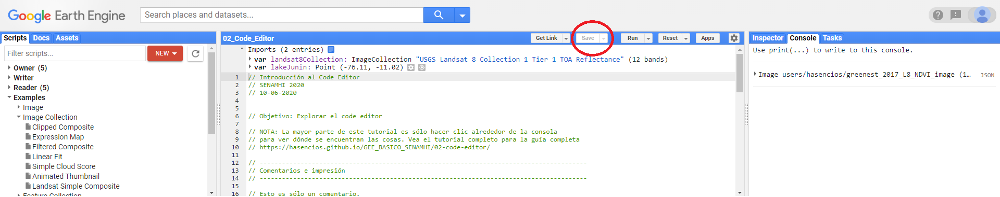
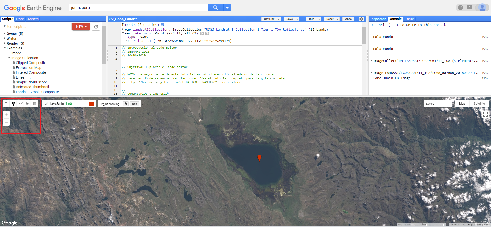
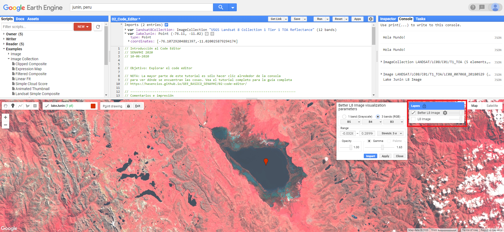
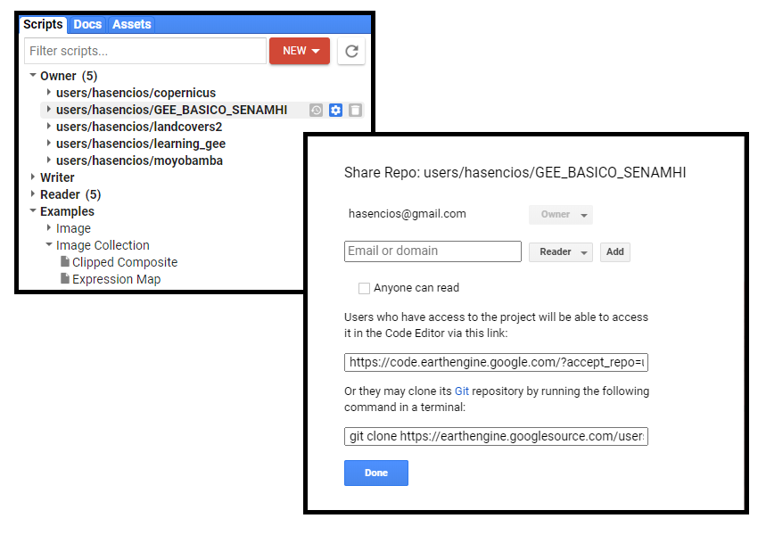

# Vista general del Code Editor

GEE tiene un entorno de desarrollo integrado (IDE) llamado Editor de código. El Editor de código tiene varias características para ayudar a hacer más fácil la programación en este entorno que exploraremos en este tutorial. Para una descripción exhaustiva, véase el <a href="https://developers.google.com/earth-engine/playground#api-reference-docs-tab" target="_blank">Earth Engine Code Editor help page</a> en las guías de usuario de GEE. 

# Ejercicios: Explorando el Code Editor

## 1. Para empezar

**Para acceder al Code Editor, escribe la siguiente url en tu navegador: <a href="https://code.earthengine.google.com" target="_blank">https://code.earthengine.google.com</a>**. Debería aparecer una interfaz de programación web como la siguiente. El siguiente diagrama tiene anotaciones que apuntan a muchas de las funcionalidades que cubriremos hoy.

 

  

#### La ventana del JavaScript Code Editor

El código Javascript está escrito en esta ventana. El editor también tiene algunas funciones de ayuda, incluyendo autocompletar para las funciones GEE, autocompletar para los paréntesis, etc. y algunas sugerencias básicas de subrayado y sintaxis.

Por ejemplo, puedes escribir comentarios usando una doble barra. Escriba lo siguiente en su editor y haga clic en el botón "Run".


// Esto es sólo un comentario.


#### La pestaña de la consola

También se puede usar `print()` para mostrar los objetos en la consola. Escriba esto y haga clic en "Run":


// Imprime algo en la consola
print("Hola Mundo!");


#### Sugerencia automática

El editor marcará las declaraciones como incompletas **`i`** si escribes sin un punto y coma al final. Puedes controlar estas sugerencias yendo a la pequeña rueda gris en la parte superior derecha de la página y activándola o desactivándola.


print("Hola Mundo!");


 

## 2. Guardar y compartir Scripts

#### Guardando Scripts

Guarde los scripts haciendo clic en el botón **Save**. Para incluir un mensaje de confirmación, usar la flecha desplegable y selecciona "Save with a description".  Los mensajes se almacenan en el historial de revisiones de cada script guardado.

 

  

*Note: Si no hiciste ningún cambio en el script, el botón* **Save** *se oscurecerá.*

Si se observa en el panel superior izquierdo, se podrá ver que el script está ahora guardado en tu gestor de **Scripts**. Tienes tres categorías de scripts: privado, compartido y ejemplos. Cada script está respaldado en Git. Si pasas el ratón por encima del nombre del script, aparecerán tres iconos que te permitirán volver a versiones anteriores, renombrar o eliminar el script. También puedes crear carpetas y hacer clic y arrastrar los scripts a esos directorios.

*Nota/advertencia: Si cambias el nombre de un script, su historial de revisiones desaparece.*

#### Compartiendo Scripts
Puedes compartir una versión estática de los scripts haciendo clic en **Get Link**. Aparecerá una url en el campo de dirección de tu navegador. Comparte este enlace para dar a otras personas acceso a tu script como *it is*. Si continúas haciendo ediciones en este script, no se actualizarán en la versión enlazada. Esta opción es útil para compartir ejemplos e instantáneas de scripts con otras personas.

    **Consejo importante: Cuando se publique en el foro de ayuda, incluye SIEMPRE el enlace de tu script para que la gente pueda ayudarte a solucionar el
	problema. Asegúrate de que todos los assets personales que utilices sean compartidos públicamente para que el script se ejecute para otros.**

#### Únete al repositorio compartido

Para colaborar de forma interactiva en el desarrollo de los scripts con otros usuarios, puede crear una carpeta compartida, invitar a sus colaboradores y colocar los scripts en esa carpeta. Hemos creado una carpeta compartida para el desarrollo de este curso.

Usted debería de haber accedido al repositorio de scripts compartidos en el Code Editor con los siguientes pasos:

<!-- 
  - Únase al grupo de Google Earth Engine SENAMHI haciendo clic en este enlace. <a href="https://goo.gl/JsnWZH" target="_blank">https://goo.gl/JsnWZH</a> . No se preocupe por los permisos de publicación. -->
- Acceder al repositorio compartido haciendo clic en este enlace: <a href="https://code.earthengine.google.com/?accept_repo=users/hasencios/GEE_BASICO_SENAMHI" target="_blank">https://code.earthengine.google.com/?accept_repo=users/hasencios/GEE_BASICO_SENAMHI</a>
- En el Code Editor, vaya a la pestaña **Scripts** en el panel superior izquierdo, desplázate hacia abajo y expande la sección "Shared". Un directorio llamado *GEE_BASIC_SENAMHI* debería aparecer con versiones de sólo lectura de los scripts completos de cada episodio.

Cualquier actualización se reflejará en estas versiones del script. Como todos los scripts GEE, estas son versiones controladas. Los permisos de lectura o escritura para individuos o grupos se pueden establecer en el Code Editor usando el pequeño icono gris de compartir que aparece a la derecha si pasas el ratón por encima del nombre del directorio en la pestaña *Scripts*. Deberías tener acceso de sólo lectura a este repositorio.

 

## 3. Accediendo a la base de datos de la nube de Google

#### Barra de herramientas de búsqueda: Encontrar una base de datos y cargarla como `ImageCollections`

Para consultar el <a href="https://code.earthengine.google.com/datasets/" target="_blank">GEE data catalog</a>, puedes introducir palabras clave en la barra de búsqueda en la parte superior del Code Editor.

Para practicar, carguemos algunas imágenes en el Code Editor. Vamos a buscar e importar el producto **Landsat Top of the Atmosphere (TOA) Reflectance Collection 1 Tier 1**.
  - Para hacer esto, ve a la barra de herramientas *Search* y escribe **Landsat 8 tier 1 TOA**.
  - Seleccione la base de datos - USGS Landsat 8 Collection 1 Tier 1 TOA Reflectance - haciendo clic en el nombre. Esto cargará los metadatos para esta colección de datos. Puedes confirmar que tienes el correcto porque el "ImageCollection ID" debe decir **LANDSAT/LC08/C01/T1_TOA**
  - Ahora, haz clic en **Import** en la ventana emergente. Una nueva variable (`ImageCollection`) se cargará en el panel "Imports" en la parte superior del Code Editor.
  - Renombre este objeto como "L8_TOA". Este objeto es una `ImageCollection`, lo que significa que es una pila de imágenes. Fíjese que tenemos que declarar este objeto usando *var*. Si haces clic en el pequeño icono cuadrado azul encima de la colección, aparecerá un ventana emergente mostrando el código que acabas de crear.


var landsat8Collection = ee.ImageCollection("LANDSAT/LC08/C01/T1_TOA")


Para ver la colección, intenta imprimirla como hiciste con el string.


print(landsat8Collection);


**¿Qué ocurre?**

Earth Engine se demora - esto significa que su petición es demasiado grande, lo que tiene sentido ya que hay miles de imágenes en la colección de Landsat 8. Para evitar esto, intenta lo siguiente:


print(landsat8Collection.limit(5))


Esto te mostrará sólo las primeras cinco imágenes para que puedas ver la colección. Puedes ver el ID de la colección, las bandas, las características, cuáles son las imágenes de la colección y sus propiedades o metadatos.

*Nota: Los desarrolladores siempre están agregando nuevas funcionalidades a la interfaz gráfica de usuario para que no tengamos que codificar. Como resultado, a veces habrá un método de apuntar y hacer clic para hacer algo que también se puede lograr escribiendo una o dos líneas de código. La función de "import" es un gran ejemplo de esto porque puedes importar una colección usando el botón "Import" en los metadatos o el comando "ImageCollection" escrito en JavaScript. Lo mismo, de dos maneras.*

#### Seleccionar un área de estudio usando la herramienta Geometry

Las herramientas de dibujo geométrico situadas en la parte superior izquierda del visor de mapas pueden utilizarse para crear manualmente puntos, líneas o polígonos. Ahora vamos a definir un área de estudio usando un punto que seleccionamos en el mapa. Utilizaremos las **Geometry Tools** para crear ese objeto.

1. Escriba "Junin, Peru" en la barra de herramientas de búsqueda y pulse intro. Nos debería de llevar a las pampas de Junín.
2. En el lado izquierdo del mapa, haz clic en el pequeño icono del marcador. El cursor se convertirá en una cruz.
3. Cambia el mapa y deja caer el cursor en el centro del lago.
4. Ahora, ve a la ventana Geometry Imports que ha aparecido. En esa ventana, nombre el punto "roi" y cambie el desplegable de **Geometry** a **FeatureCollection**.

Ahora ha creado un nuevo objeto punto y lo ha cargado como una `FeatureCollection`. Ahora puede usar esta `FeatureCollection` como una forma de filtrar geográficamente conjuntos de datos sólo para tu región.

 

  

¿Divertido? Puedes explorar más a fondo cómo configurar las geometrías en la sección <a href="https://hasencios.github.io/GEE_BASICO_SENAMHI/05-classify-imagery/" target="_blank">Clasificación Supervisada de Imágenes de Satélite</a> de este tutorial.  

#### Filtrar la Image Collection

Uno de los mayores beneficios de la API de JavaScript frente a la de Python es la capacidad de renderizar rápidamente sobre la marcha geovisualizaciones de sus imágenes y resultados. Ahora vamos a visualizar una imagen de la colección de Landsat 8.

Vamos a filtrar la colección a una imagen por:

  - nuestra área de estudio que definimos con un punto
  - sólo un año de imágenes (2018)
  - clasificando las imágenes por la cobertura total de nubes (de menos nubes a más nubes)
  - eligiendo la imágen superior (menos nublada)

En esencia, esto nos permite ordenar la colección completa de Landsat 8 y cargar la mejor imagen disponible para nuestra región de interés para el 2018.


// Cargar imágenes de Landsat 8
var image = ee.Image((landsat8Collection)
    // Filter to get only images under the region of interest.
    .filterBounds(lakeJunin)
    // Filter to get only one year of images.
    .filterDate('2018-01-01', '2018-12-31')
    // Select just the optical bands
    .select(['B[1-7]'])
    // Sort by scene cloudiness, ascending.
    .sort('CLOUD_COVER')
    // Get the first (least cloudy) scene.
    .first());



Usa una declaración impresa para comprobar lo que acabamos de hacer:


print(image, 'Lake Junin L8 image')


Ahora hemos filtrado TODO el archivo de Landsat 8 hasta la imagen menos nublada para nuestra área de estudio en 2018. Sin embargo, todavía tenemos que visualizarla, lo que haremos usando la función `Map.addLayer`.

*Nota: ¿No está seguro de lo que hace esta función? Búscala en la pestaña* **Docs** *para aprender los argumentos.*


Map.addLayer(image,{},  'L8 Image');


#### Gestionar las capas

El mapa no luce tan bien. Definamos qué bandas usar y completemos algunos otros parámetros de visualización usando el administrador de capas. Usaremos la reflectancia en el rango visible desde el rojo (Banda 4), el verde (Banda 3) y el azul (Banda 2) para hacer una imagen de color verdadero.  Podemos usar los conocimientos previos para hacer una imagen que luzca mejor:


Map.addLayer(image, {bands: ['B4', 'B3', 'B2'], max: 0.5, gamma: 2}, 'Better L8 Image');


Aunque a menudo no es posible conocer el mínimo, máximo y el estiramiento óptimos. Se ha añadido la herramienta **Layer Manager** que se encuentra en la esquina superior derecha del mapa. Esta barra de herramientas le permitirá hacer clic en las capas, así como ajustar su transparencia y configurar interactivamente los parámetros de visualización de cada capa. Puede usar esta herramienta para averiguar qué parámetros pasar al `Map.addLayer`.

 

  

También puedes cambiar entre los botones **Map** o **Satellite** en la parte superior derecha del panel del mapa para cambiar la capa base.

Para más información sobre la visualización de imágenes, vea el <a href="https://developers.google.com/earth-engine/image_visualization" target="_blank">GEE Visualization Guide</a> o la <a href="https://developers.google.com/earth-engine/tutorial_api_02" target="_blank">GEE Visualization tutorial</a>.

#### La pestaña Inspector

Otra forma de inspeccionar y explorar su imagen es a través de la herramienta de inspección. La consola del Inspector le permite consultar el mapa de forma interactiva. Si tienes la imagen cargada, te dará información sobre esa imagen en el punto en el que también hiciste clic.

En la parte superior derecha, cambie a la pestaña **Inspector** y haga clic en el mapa donde hay tierra. Ahora haga clic donde hay agua. Cambie entre el gráfico y la lista de valores.

## COMENCEMOS A JUGAR

Juega por tu cuenta con los parámetros de estiramiento y utiliza el Inspector para explorar el mapa, haciendo clic sobre el continente, el suelo desnudo, el bosque y el agua.

Si ya lo has hecho, puedes jugar a dejar caer el punto en otro lugar y mirar una imagen diferente de tu lugar favorito.

También podrías cambiar las fechas para observar una imagen de la época de verano y ver cómo cambia la reflectancia cuando hay nieve en el suelo.

## 4. Conseguir ayuda

There are many entry points for getting help tucked into the Code Editor. Familiarizing yourself with these tools can help soften the learning curve.
Hay muchas formas de conseguir ayuda en el Code Editor. Familiarizarse con estas herramientas puede ayudar en el aprendizaje.

#### Referencia API (pestaña Docs)

Al lado de la pestaña **Scripts** está la pestaña **Docs**, que tiene la documentación completa y buscable de la API de JavaScript para cada función. La documentación está organizada por tipo de datos GEE. Cada tipo de datos tiene un conjunto específico de funciones que se pueden aplicar a él.

#### El botón Help

El botón **Help** es una puerta de entrada a muchos recursos, incluyendo enlaces a:

 - el <a href="https://developers.google.com/earth-engine/" target="_blank">**Developers Guide**</a>
para los tutoriales, referencias y guías oficiales de GEE. Este es el primer lugar al que voy cuando necesito buscar cómo escribir un código.

 - el **Help Forum** donde puedes publicar preguntas y obtener respuestas. Si no puedo encontrar una guía para mi pregunta específica en las Guías GEE, entonces busco palabras clave de mi problema/pregunta en el foro. Como la gente comparte enlaces a sus códigos, a menudo puedes encontrar grandes ejemplos de soluciones aquí.

 -  <a href="https://developers.google.com/earth-engine/tutorials" target="_blank">Existing tutorials</a> y la <a href="https://developers.google.com/earth-engine/edu" target="_blank">Earth Engine for Higher Education resources</a> escrito por el equipo de GEE y otros (¡incluso algunos en japonés!)

 - Una lista de atajos de teclado

 - enlaces a la página de **Suggest a Dataset**

#### Ejemplos en el **Shared Scripts**

Un último lugar donde puede obtener ayuda es desplazándose hacia abajo y mirando los ejemplos que se encuentran en el **Shared Scripts** en la pestaña **Scripts**.  

 

## 5. Importar y exportar sus propios Assets

#### Importar imágenes y archivos vectoriales
Además de usar todos los increíbles archivos de Google, los usuarios también pueden importar sus propios datos como imágenes (rasters) o tablas (vectores). La pestaña **Assets** de la izquierda es donde se pueden importar, compartir y administrar estos propios activos. Puedes subir imágenes o tablas (datos vectoriales) aquí.

Cuando publiques en el foro, asegúrate de marcar la casilla "Anyone Can Read" en la ventana emergente de los recursos de intercambio para que todos los usuarios del foro puedan ejecutar tu código. Si tienes un Asset privado y no lo haces público, otras personas no podrán ejecutar tu código. Si no quieres compartir tus datos privados, puedes crear un ejemplo ficticio para compartir en los foros utilizando puntos o polígonos dibujados a mano.

 

  

Para un ejemplo de script que utiliza datos importados, véase <a href="https://hasencios.github.io/GEE_BASICO_SENAMHI/06-time-series/" target="_blank">Leccion 06 Series de Tiempo</a>. Para obtener instrucciones detalladas de Google sobre cómo subir, compartir y administrar activos, consulte el <a href="https://developers.google.com/earth-engine/asset_manager" target="_blank">Assets Manager page</a> en el sitio web de GEE.

#### Exportando y la pestaña Tasks
En lugar de imprimir en la consola, para tareas más grandes puede que quieras exportar las salidas a tu Google Drive o Cloud Storage usando las funciones `Export` en tu código. Cuando se ejecutan, estas generan una nueva tarea en la pestaña `Task` en el panel superior derecho. Necesitarás entonces "Run" esta tarea para iniciar realmente la transferencia de información. Una vez que inicie una tarea, se le pedirá que introduzca los detalles sobre la resolución, tamaño, formato y destino si no lo incluyó en su código. Puedes pasar el ratón por encima de la tarea y hacer clic en el icono "?" para ver el estado y también para obtener el número de la tarea. Si tu tarea no se está ejecutando, puedes compartir este número como referencia en el foro de desarrolladores.

Exportaremos información vectorial en <a href="https://hasencios.github.io/GEE_BASICO_SENAMHI/03-load-imagery/" target="_blank">Leccion 03 Cargar Imágenes</a> de este tutorial.

Para instrucciones detalladas sobre Export, véase la <a href="https://developers.google.com/earth-engine/exporting" target="_blank">Exporting Data page</a> en el sitio web de GEE. También presentaremos algunos ejemplos para exportar en módulos posteriores de este tutorial.

 
 

Enlace del código completo que usamos en esta lección:
<a href="https://code.earthengine.google.com/1cbba818c21b948f0ae43ae3716e75ee" target="_blank">https://code.earthengine.google.com/1cbba818c21b948f0ae43ae3716e75ee</a>

### Diviértete con el Code Editor!!!
