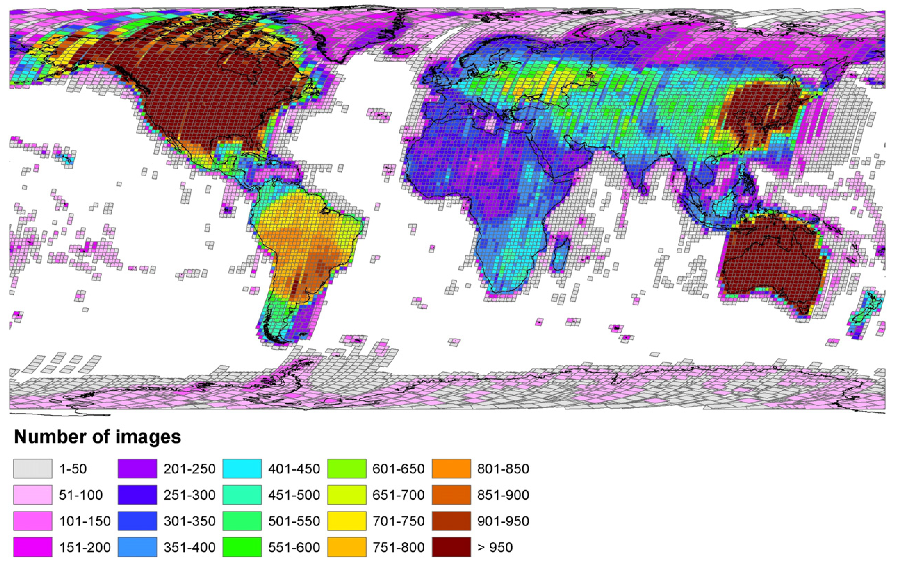
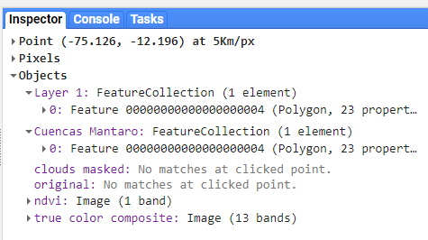
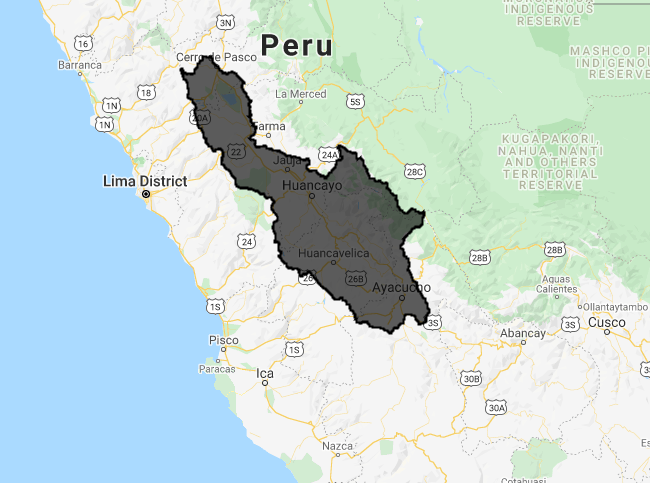
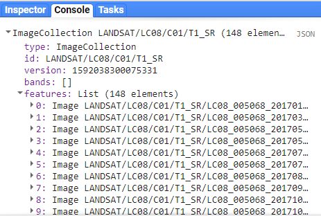
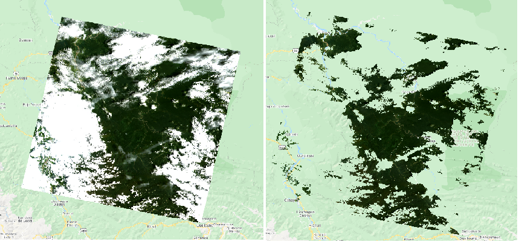
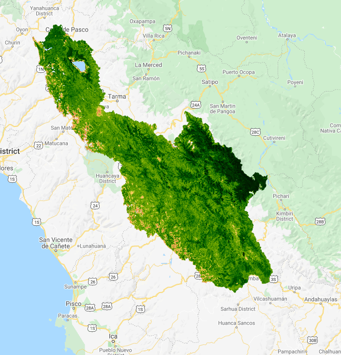
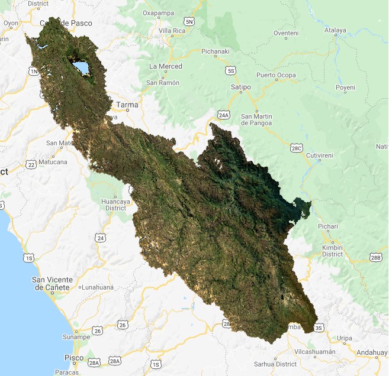
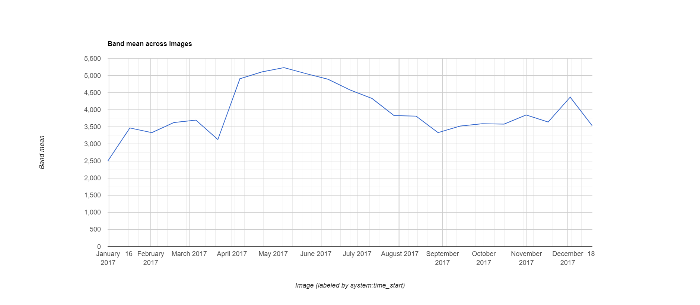

# Descripción general: Catálogo de imágenes satelitales a escala regional
La mayoría de los productos satelitales se dividen en bloques para su distribución. Los datos globales de Landsat se dividen en escenas de ~180 km2, con identificadores únicos de path/row. *<a href="https://www.sciencedirect.com/science/article/abs/pii/S0034425715302194" target="_blank">Wulder et al. (2016)</a>* sugieren  que cada escena es fotografiada cada 16 días por Landsat 8 y cada 16 días por Landsat 7 (aproximadamente 45 veces al año). Los bordes de cada trayectoria se superponen, proporcionando una mayor frecuencia temporal en estas áreas. Sin embargo, los cielos nublados durante el paso de los satélites y otras anomalías de adquisición hacen que ciertas escenas o píxeles sean inutilizables.

*USGS Landsat archive holdings as of January 1, 2015 (Wulder et al. (2016)).*

*Forest loss in Sumatra's Riau province, Indonesia, 2000-2012. Credit: Hansen, Potapov, Moore, Hancher et al., 2013*
-->
 
<!--**455 escenas de Landsat cubren los Estados Unidos:**-->
 

  

 
<!--**455 escenas de Landsat cubren los Estados Unidos:**-->
 

  

Para la mayoría de las aplicaciones a escala regional, se tendrá que combinar múltiples imágenes de satélite para cubrir completamente su extensión espacial y completar los datos faltantes causados por las nubes, etc. Google Earth Engine (GEE) es particularmente adecuado para estas tareas.

# Ejericio: Flujo básico de trabajo GEE
Aquí, aprovecharemos GEE para crear un composite que represente el pico de la temporada de crecimiento de cultivos para una cuenca de interés.

### Image Collections
Una pila o serie temporal de imágenes se llaman `Image Collections`. Cada fuente de datos disponible en GEE tiene su propia Image Collection y su propio ID (por ejemplo, el [Landsat 5 SR collection](https://developers.google.com/earth-engine/datasets/catalog/LANDSAT_LT05_C01_T1_SR), o el producto [CHIRPS Daily: Climate Hazards Group InfraRed Precipitation with Station Data (version 2.0 final)](https://developers.google.com/earth-engine/datasets/catalog/UCSB-CHG_CHIRPS_DAILY). También se puede crear Image Collection a partir de imágenes individuales o fusionar colecciones existentes. Puede encontrar más información sobre las Image Collection [here in the GEE Developer's Guide](https://developers.google.com/earth-engine/ic_creating).

Para generar imágenes que cubran grandes áreas espaciales y para llenar los vacíos de una imágen debido a las nubes, etc., podemos cargar una `ImageCollection` completa, pero filtrar la colección para devolver sólo los períodos de tiempo o las ubicaciones espaciales que sean de interés. Hay filtros de acceso directo para los que se utilizan comúnmente (imageCollection.filterDate(), imageCollection.filterBounds()...), pero pueden utilizarse la mayoría de los filtros de la sección `ee.Filter()` de la pestaña Docs. Más información sobre [filters on the Developer's Guide](https://developers.google.com/earth-engine/ic_filtering).

### Cargar archivos vectoriales
Trabajaremos en la creación de un composite para una cuenca del Perú. La forma más fácil de filtrar una ubicación irregular sin tener que identificar las rutas y filas de los mosaicos de la imagen satelital es usar un polígono vectorial.

Hay tres maneras de obtener datos de vectores en GEE:

  * [Cargar un shapefile](https://developers.google.com/earth-engine/importing) directamente a su carpeta personal *Asset* en el panel superior izquierdo. Puedes crear subcarpetas y establecer permisos para compartir según sea necesario. Utilizamos un archivo vectorial Asset en el [modulo Accediendo al catálogo de imágenes de satélite](https://hasencios.github.io/GEE_BASICO_SENAMHI/03-load-imagery/).
  * Utilizar un conjunto de datos de vectores existente en GEE. [Navegue por el catálogo de datos vectoriales aquí](https://developers.google.com/earth-engine/vector_datasets).
  * Dibuje manualmente puntos, líneas y polígonos usando las herramientas de geometría del Code Editor. Haremos esto en el [Modulo de Clasificación Supervisada de Imágenes de Satélite](https://hasencios.github.io/GEE_BASICO_SENAMHI/05-classify-imagery/).

Aquí, usaremos un activo vectorial existente, el archivo de cuencas del Perú que ha sido cargado por el instructor como un Asset [aquí](https://github.com/hasencios/GEE_BASICO_SENAMHI/blob/gh-pages/data/Cuencas2012Peru.zip).

Para cargar un archivo vectorial de sus Assets en su espacio de trabajo, necesitamos usar el "filepath" y lanzarlo a un tipo de datos `ee.FeatureCollection`. Lee más aquí: ["Managing Assets" in the Developer's Guide](https://developers.google.com/earth-engine/asset_manager#importing-assets-to-your-script).


// cargar un polígono de límite de cuenca (una base de datos vectorial pública ya en GEE)
// nota: véase el tutorial mencionado arriba para obtener orientación sobre la importación de bases de datos de vectores
var watersheds = ee.FeatureCollection('users/hasencios/Cuencas_Peru');
print(watersheds.limit(5));
Map.centerObject(watersheds,5);
Map.addLayer(watersheds, {}, 'watersheds')



 

  

### La herramienta Inspector
La herramienta "Inspector" permite consultar las capas del mapa en un punto. Lo usaremos para ayudarnos a seleccionar una cuenca específica. Para usar la herramienta "Inspector", haga clic en la pestaña "Inspector" en el panel superior derecho para activarla. Luego haga clic en cualquier lugar dentro del Visor de Mapas. Se mostrarán las coordenadas de su clic, junto con el valor de las capas del mapa en ese punto.

Podemos usar esto para encontrar el atributo "name" de nuestra cuenca de interés (¡elige la que quieras!).

 

  

Una vez que hayas determinado la propiedad "name" de tu cuenca, usa la función featureCollection.filterMetadata() para extraer esta cuenca de la base de datos completa.


// use la herramienta del inspector para encontrar el nombre de una cuenca que le interese
var watershed = watersheds.filterMetadata('NOMBRE', 'equals', 'Cuenca Mantaro');

// imprima la metadata de la cuenca
print('Cuenca Mantaro',watershed);

// establecer la vista del mapa y el zoom, y añadir la línea divisoria de aguas al mapa
Map.centerObject(watershed,6);
Map.addLayer(watershed,{},'Cuencas Mantaro');


Cuenca de interés: Mantaro
 

  

### Filtrar una Image Collection
Aquí, estamos seleccionando todas las imágenes en el [Landsat 8 Surface Reflectance collection](https://code.earthengine.google.com/dataset/LANDSAT/LC08/C01/T1_SR) adquirido sobre nuestra cuenca de interés.

*Consejo: Los ID de las Image collection se encuentran en la barra de herramientas de "Search" en la parte superior del editor de códigos o a través de la búsqueda en el [data archive](https://code.earthengine.google.com/datasets/).*


// cargue todas las imágenes Landsat 8 SR dentro de los límites del polígono para el año 2017
var l8collection = ee.ImageCollection('LANDSAT/LC08/C01/T1_SR')
          .filterBounds(watershed)
          .filterDate('2017-01-01', '2017-12-31');
print(l8collection);


Imprimir nuestra colección filtrada en la consola nos dice cuántas imágenes hay en nuestro filtro (148) así como los nombres de las bandas y las propiedades de las imágenes de nuestra colección:
 

  

### Aplicar funciones
Como puedes ver al navegar por la pestaña `Docs` en el panel superior izquierdo del Code Editor, hay funciones GEE específicas para los tipos de datos `Image` y `ImageCollection`. Hay muchas, incluyendo operadores matemáticos y booleanos, convoluciones y estadísticas focales, y transformaciones espectrales y análisis de textura espacial. Navegue por la lista, o lea sobre las operaciones generales disponibles en el [GEE Developer's Guide "Image Overview"" section](https://developers.google.com/earth-engine/image_overview).

A menudo, queremos usar una función sobre cada imagen de una Image Collection. Para ello, necesitamos esencialmente "hacer un bucle" a través de cada imagen de la colección de imágenes. En GEE, los "bucles" se realizan con la función .map().

**Evitar los bucles reales a toda costa.** Usar un bucle for lleva la operación al navegador (mala práctica). Usando imageCollection.map() envía la operación a los servidores de Google para las ejecuciones distribuidas (buena práctica). Los bucles implementados de forma típica para la sentencia for, llevan la operación al navegador, y no funcionan bien, si es que funciona.

Se puede encontrar más información sobre la aplicación de funciones a las Image collection [here in the Developer's Guide](https://developers.google.com/earth-engine/ic_mapping).

El concepto .map() se aplica también a las `featureCollections` - para aplicar una función a cada característica de una colección, aplicamos esa función a través de la featureCollection con la featureCollection.map(). Ver ["Mapping over a Feature Collection"](https://developers.google.com/earth-engine/feature_collection_mapping) en la Guía del Desarrollador.

### Enmascarar nubes
Aquí, haremos uso de la banda `pixel_qa` que se proporciona con los productos SR para enmascarar los píxeles con nubes, sombras de nubes y nieve. Enmascararemos los píxeles de la imagen basándonos en el valor de pixel_qa.

Definimos explícitamente una nueva función llamada "maskClouds" y la aplicamos a cada imagen de la imageCollection utilizando `imageCollection.map()`. Las funciones necesitan explícitamente **return** la salida final.



// Enmascarar píxeles con nubes y sombras de nubes -------------------------------------

// Los productos de reflectancia superficial vienen con una banda 'pixel_qa'.
// que se basa en la cfmask. Lea más aquí:
// https://landsat.usgs.gov/landsat-surface-reflectance-quality-assessment

// crear la función de enmascarar nubes, sombras de nubes, nieve
var maskClouds = function(image){
  // make a new single band image from the pixel qa band
  var pixel_qa = image.select('pixel_qa');
  // keep clear (0) and water (1) pixels
  return image.updateMask(pixel_qa.eq(322));   
};

// usar "map" para aplicar la función a cada imagen de la colección
var l8masked = l8collection.map(maskClouds);

// visualizar la primera imagen de la colección, antes y después de la máscara
var visParams = {bands: ['B4','B3','B2'], min: 150, max: 2000}

Map.addLayer(ee.Image(l8masked.first()), visParams, 'clouds masked', false)
Map.addLayer(ee.Image(l8collection.first()), visParams, 'original', false)


 

  

### Calcular el índice NDVI como una nueva banda
Del mismo modo, si queremos calcular el NDVI en cada imagen y añadirlo como una nueva banda, tenemos que crear una función y mapearla sobre la colección. Aquí, usamos la función `normalizedDifference()`. [Mathematical Operations page in the GEE Developer's Guide](https://developers.google.com/earth-engine/image_math) proporciona más información sobre cálculos raster simples y complejos.


// crear una función para añadir el NDVI usando la banda NIR (B5) y roja (B4)
var getNDVI = function(img){
  return img.addBands(img.normalizedDifference(['B5','B4']).rename('NDVI'));
};

// ejemplo extra: una función equivalente usando álgebra de mapas
var getNDVI2 = function(img){
  return img.addBands(img.select('B5').subtract(img.select('B4'))
            .divide(img.select('B5').add(img.select('B3'))));
};

// aplicar la función sobre la image collection
var l8ndvi = l8masked.map(getNDVI);

// imprime una imagen para ver que la banda está ahora allí
print(ee.Image(l8ndvi.first()));


### Crear un Composite "Greenest Pixel"
Ahora necesitamos reunir la Image Collection para crear una imagen continua a través de la cuenca. Hay varias opciones de mosaico/composición disponibles, desde simples composiciones de valor máximo (`imageCollection.max()`) y mosaicos sencillos con la imagen más reciente (`imageCollection.mosaic()`).   [Compositing and Mosaicking page on the Developer's Guide](https://developers.google.com/earth-engine/ic_composite_mosaic) proporciona más ejemplos.

Aquí, usaremos la función `imageCollection.qualityMosaic()`. Al priorizar la imagen a utilizar en base a una banda específica, este método asegura que los valores de todas las bandas se tomen de la misma imagen. A cada píxel se le asignan los valores de la imagen con el valor más alto de la banda deseada.

Usaremos esto para hacer un "greenest pixel composite" para nuestra cuenca basado en la banda del NDVI que acabamos de calcular. La imagen compuesta final retendrá todas las bandas en la entrada (a menos que especifiquemos lo contrario). Cada píxel en la imagen compuesta podría potencialmente provenir de imágenes adquiridas en fechas diferentes, pero todas las bandas dentro de cada píxel son de la misma imagen. En general, esto proporciona la mejor instantánea disponible del paisaje en el pico de la temporada de crecimiento, independientemente del momento fenológico dentro del año.


// para cada pixel, seleccione el "mejor" conjunto de bandas de las imágenes disponibles
// basado en el máximo NDVI/greenness
var composite = l8ndvi.qualityMosaic('NDVI').clip(watershed);
print(composite);

// Visualizar el NDVI
var ndviPalette = ['FFFFFF', 'CE7E45', 'DF923D', 'F1B555', 'FCD163', '99B718',
               '74A901', '66A000', '529400', '3E8601', '207401', '056201',
               '004C00', '023B01', '012E01', '011D01', '011301'];
Map.addLayer(composite.select('NDVI'),
            {min:0, max: 1, palette: ndviPalette}, 'ndvi');


El máximo anual de NDVI a través de esta cuenca hidrográfica destaca las zonas altoandinas con presencia de suelo desnudo y en las cercanías la selva, los más verdes :

 

  

También podemos usar esta imagen compuesta para visualizar una composición de color verdadero usando las bandas RGB:


// Visualizar el compuesto en color verdadero 
Map.addLayer(composite, {bands: ['B4', 'B3', 'B2'], min: 0, max: 2000}, 'true color composite', false);


 

  

### Visualizar los resultados en un gráfico
Para ilustrar brevemente la capacidad de GEE de generar gráficos, cargamos el producto de datos MODIS NDVI para trazar la serie temporal anual de NDVI medio de nuestra cuenca. La generación de gráficos también está cubierto en el [módulo 04 Reductores espaciales y temporales](https://hasencios.github.io/GEE_BASICO_SENAMHI/04-reducers/).



// Gráfico de series temporales anuales del NDVI medio en la cuenca
// de nuestro compuesto calculado de Landsat 8
var chart = ui.Chart.image.series({
    imageCollection: l8ndvi.select('NDVI'),
    region: watershed,
    reducer: ee.Reducer.mean(),
    scale: 250,
})
print(chart)  //** Puede exportar la figura o los datos en la ventana

// También se puede comparar con el producto MODIS de 16 días

// añadir series temporales de satélites: producto MODIS NDVI 250m de 16 días
var modis = ee.ImageCollection('MODIS/006/MOD13Q1')
          .filterBounds(watershed)
          .filterDate('2017-01-01', '2017-12-31')
          .select('NDVI');

// Gráfico de series temporales anuales del NDVI medio en la cuenca
// del producto suavizado MODIS 16 días
var chart = ui.Chart.image.series({
    imageCollection: modis,
    region: watershed,
    reducer: ee.Reducer.mean(),
    scale: 250
})
print(chart)



Tenga en cuenta que puede exportar los datos subyacentes del gráfico mediante el icono de la flecha que aparece...
 

  

### Exportar los resultados como una Table
La manera más eficiente de obtener datos de GEE es en una tabla. Esta forma tiene el beneficio de estar codificada y por lo tanto ser totalmente reproducible. Exportar tablas también requiere mucha menos potencia de cálculo que exportar una imagen completa. Cuando realices un análisis, piensa bien en cómo puedes dejar el raster en la nube y extraer los datos que necesitas como una matriz.



// Use los botones de la tabla emergente para exportar el .csv, o puede hacer un guión
// la exportación como sigue utilizando un reductor:

// obtener el valor medio de la región de cada imagen
var ts = modis.map(function(image){
  var date = image.get('system:time_start');
  var mean = image.reduceRegion({
    reducer: ee.Reducer.mean(),
    geometry: watershed,
    scale: 250
  });
  // y devuelve una característica con geometría 'null' con propiedades (dictionary)  
  return ee.Feature(null, {'mean': mean.get('NDVI'),
                            'date': date})
});

// Exportar una tabla de fecha .csv, media NDVI para la cuenca
Export.table.toDrive({
  collection: ts,
  description: 'SENAMHI_2017_MODIS_NDVI_stats',
  folder: 'GEE_SENAMHI',
  fileFormat: 'CSV'
});

// Y PULSE "RUN" EN LA PESTAÑA DE TAREAS EN EL PANEL SUPERIOR DERECHO



Para ejecutar las tareas de exportar, debes ir a la pestaña 'Tasks' en el panel superior derecho y presionar 'Run'.

 

  

### Exportar Images
Los usuarios pueden exportar los resultados de sus manipulaciones de imágenes a su carpeta de activos de GEE para su uso posterior dentro de la plataforma o a sus cuentas personales de Google Drive o de Google Cloud Storage. Aquí, exportaremos una imagen de una sola banda de NDVI máximo anual para nuestra cuenca. Se proporcionaran ejemplos para exportar a Google Drive. Se puede encontrar más información sobre exportar
 [here in the Developers Guide](https://developers.google.com/earth-engine/exporting).

En la API de JavaScript, lo que se quiera exportar se envía a la pestaña 'Tasks' en el panel superior derecho. Para evitar que los usuarios inunden el sistema inadvertidamente con tareas gratuitas y accidentales, es necesario ejecutar explícitamente la tarea individualmente desde la pestaña 'Task'. Puede cambiar los nombres de los archivos y otros parámetros aquí, si es necesario, o codificarlos en su script.

Al exportar a Google Drive, GEE encontrará la carpeta con el nombre especificado y no necesita la ruta de archivo completa. Si esta carpeta aún no existe, la creará en tu unidad.



// La exportación es innecesaria, pero aquí están los ejemplos de código para salvar un
// imagen compuesta si se desea.  

// seleccione sólo la banda de ndvi
var ndvi = composite.select('NDVI');

// Ejemplo de exportación a Google Drive
// (nota: hay que pulsar 'Run' en la pestaña de tareas en el panel superior derecho)
Export.image.toDrive({
  image: ndvi,
  description: 'SENAMHI_2017_L8_NDVI_image',
  scale: 30,
  region: watershed.geometry().bounds(), // .geometry().bounds() needed for multipolygon
  crs: 'EPSG:32718',
  folder: 'GEE_SENAMHI',
  maxPixels: 2000000000
});

// Ejemplo de exportación de una carpeta de assets
// (nota: hay que pulsar 'Run' en la pestaña de tareas en el panel superior derecho)
Export.image.toAsset({
  image: ndvi,
  description: 'SENAMHI_2017_L8_NDVI_image',
  assetId: 'users/yourname/SENAMHI_2017_L8_NDVI_image',
  scale: 30,
  region: watershed.geometry().bounds(),
  pyramidingPolicy: {'.default':'mean'}, // use {'.default':'sample'} for discrete data
  maxPixels: 2000000000
});



Se puede acceder a una versión estática del script aquí: [https://code.earthengine.google.com/8418ba2b48095a765720d79982bcfab7](https://code.earthengine.google.com/8418ba2b48095a765720d79982bcfab7)