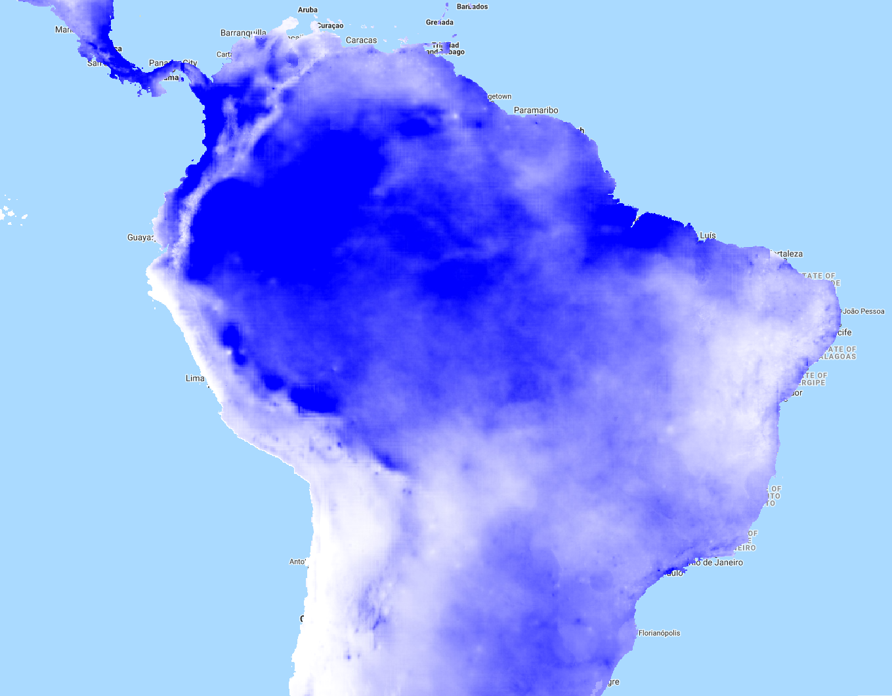
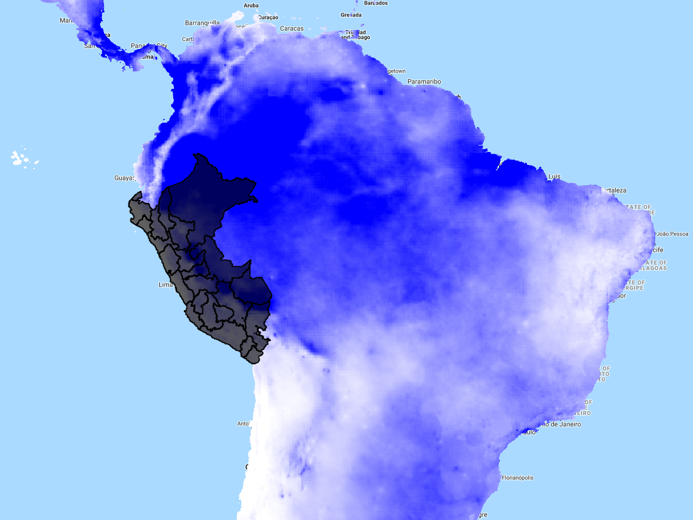
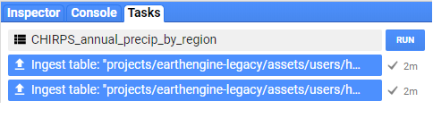

# Reductores: Descripción general

En Google Earth Engine (GEE), [reducers](https://developers.google.com/earth-engine/reducers_intro) se utilizan para agregar datos en el tiempo, el espacio y otras estructuras de datos. Pertenecen a la clase `ee.Reducer` e incluyen estadísticas de resumen, histogramas y regresión lineal, entre otros. Aquí se presenta una demostración visual que muestra un reductor aplicado a una `ImageCollection`:

 

  

Las reducciones también pueden ocurrir en el espacio, sobre las bandas dentro de una imagen, o sobre los atributos de una `FeatureCollection`. Ver el [Reducer Overview](https://developers.google.com/earth-engine/reducers_intro) en la Guía del Desarrollador de Google para más información.

En el Módulo 03: Accediendo al Catálogo de Imágenes de Satélite, usamos un límite vectorial y un rango de fechas para filtrar una colección de imágenes, aplicamos un algoritmo (NDVI) sobre esa colección, y luego la redujimos a una imagen en la que cada valor de píxel era su máximo NDVI. Aquí seguimos el mismo flujo de trabajo, pero en su lugar reduciremos usando `imageCollection.sum()` para calcular la precipitación anual total para cada píxel a nivel global (reductores temporales). Luego daremos un paso más y usaremos el reductor espacial 'reduceRegions' para calcular la precipitación anual total para cada región del Perú.

# Ejercicio: Obtener datos climáticos desde GEE
Aquí demostraremos cómo aplicar un reductor temporal y espacial para obtener datos de precipitación anual por región del Perú.

### El catálogo de datos de GEE
Un objetivo secundario de este ejercicio es utilizar GEE para acceder a bases de datos comunes almacenados en archivo que puedan resultar atractivos para quienes no estén directamente relacionados con el sensoramiento remoto. Como se describe en la [Introducción](https://hasencios.github.io/GEE_BASICO_SENAMHI/01-introduction/), GEE provee diferentes bases de datos pertinentes para los análisis de los sistemas terrestres. El archivo completo puede ser consultado [here](https://code.earthengine.google.com/datasets/). En este ejercicio, usaremos el [CHIRPS Daily: Climate Hazards Group InfraRed Precipitation with Station Data (version 2.0 final)](https://developers.google.com/earth-engine/datasets/catalog/UCSB-CHG_CHIRPS_DAILY) para obtener información de precipitaciones. CHIRPS es una base de datos de precipitaciones cuasi mundiales de más de 30 años (desde 1981-hasta la actualidad), que incorpora imágenes satelitales de 0.05° de resolución espacial con datos estaciones in situ para crear series temporales de grillas de precipitación para el análisis de tendencias y el monitoreo estacional de sequías.

### Temporal Reducer: Generar un Image Statistics en el tiempo
Tal como se discutió en el [módulo Accediendo al catálogo de imágenes de satélite
](https://hasencios.github.io/GEE_BASICO_SENAMHI/03-load-imagery/), una `ImageCollection` es una pila o serie temporal de imágenes. Los reductores se usan para derivar una sola `Image` basada en la `ImageCollection`. Las operaciones ocurren en por píxeles. Seguiremos este flujo de trabajo:

  * "Load" los datos de la GRIDMET como una `ImageCollection`
  * Filtrar la banda de datos de precipitaciones y las fechas deseadas
  * **Reduce** 365 imágenes "raster" de precipitaciones diarias en una imagen "raster" de totales de precipitaciones anuales (suma de rasters por píxel)
  * Visualizar el resultado

#### Cargar y filtrar una ImageCollection
Primero, necesitamos identificar el **ImageCollection ID** para el producto de datos CHIRPS y el **band name** para los datos de precipitación (y comprobar cualquier metadato relevante). Esto se puede encontrar en el [data catalog](https://code.earthengine.google.com/datasets/) o directamente en el [GEE Code Editor](https://code.earthengine.google.com/) en la parte superior del panel central.

Para la [CHIRPS](https://developers.google.com/earth-engine/datasets/catalog/UCSB-CHG_CHIRPS_DAILY#description), sabemos que el ID de ImageCollection = 'UCSB-CHG/CHIRPS/DAILY' y el nombre de la banda de precipitación es 'precipitation'. Específicamente `select` esta banda solamente.



// cargar datos de precipitación (mm/día): 365 imágenes por año 
var precipCollection = ee.ImageCollection("UCSB-CHG/CHIRPS/DAILY")
                    .select('precipitation')   // seleccionar solo la banda precipitation
                    .filterDate('2019-01-01', '2019-12-31');
print(precipCollection, 'precipCollection');  



Al imprimir la colección resultante en la consola, podemos ver que hemos accedido a 365 imágenes, cada una con una banda llamada 'precipitation'.

#### Aplicar un Sum Reducer y visualizar los resultados
El operador `imageCollection.reduce()` permite aplicar cualquier función de la clase `ee.Reducer()` a todas las imágenes de la colección. Si tu `ImageCollection` tenía múltiples bandas, el reductor se aplica por separado a todas las bandas (a menos que el reductor utilice múltiples bandas como entradas, en cuyo caso el número de bandas de la colección de imágenes debe coincidir con el número de entradas que requiere el reductor). Puede encontrar los reductores disponibles y sus descripciones en la referencia de la API que se puede buscar en la pestaña **Docs** en el panel superior izquierdo del Code Editor.

 

  

Algunos reductores comúnmente usados tienen una sintaxis abreviada, como `imageCollection.mean()`, `imageCollection.min()`, y convenientemente, `imageCollection.sum()`. Ambas sintaxis se demuestran en el siguiente fragmento de código.



// cargar datos de precipitación (mm/día): 365 imágenes por año 
var precipCollection = ee.ImageCollection("UCSB-CHG/CHIRPS/DAILY")
                    .select('precipitation')   // seleccionar solo la banda precipitation
                    .filterDate('2019-01-01', '2019-12-31');
print(precipCollection, 'precipCollection');  

// reducir la image collection a una sola imagen sumando los 365 patrones diarios
var annualPrecip = precipCollection.reduce(ee.Reducer.sum());
print(annualPrecip, 'annualPrecip');

// sintaxis equivalente
var annualPrecip2 = precipCollection.sum();

// visualizar la precipitación anual
var precipPal = ['white','blue']; // store palette as variable        
Map.addLayer(annualPrecip, {min: 60, max: 3000, palette: precipPal}, 'precip');



Al imprimir la imagen resultante en la consola, podemos ver que ahora tenemos una imagen con una banda llamada 'precipitation_sum'. Esto es lo que parece:

 

  

### Spatial Reducer: Generar un Image Statistics por regiones
Ahora tomemos la imagen de la precipitación anual que acabamos de crear y obtengamos la precipitación media areal por condado en los Estados Unidos. Para obtener las estadísticas de la imagen para múltiples regiones, podemos usar una función [image.reduceRegions()](https://developers.google.com/earth-engine/reducers_reduce_regions). Usaremos una [FeatureCollection](https://developers.google.com/earth-engine/feature_collections) para almacenar nuestra base de datos vectorial de los condados. Tengan en cuenta que también hay un operador [image.reduceRegion()](https://developers.google.com/earth-engine/reducers_reduce_region) si quería resumir una región del polígono solamente. El resultado de la operación `reduceRegiones()` se añade a las propiedades de cada característica en la `FeatureCollection`.

  >*Una nota importante sobre el parámetro de escala**

  > GEE utiliza una evaluación de su código que sólo ejecuta las partes de su script necesarias para los resultados esperados - en el caso del entorno de la API de JavaScript. *GEE ejecutará sus cálculos con la resolución de su vista actual del mapa en el Code Editor, a menos que usted le diga lo contrario*. Siempre que sea posible, establezca explícitamente los argumentos de escala para forzar a GEE a trabajar en una escala que tenga sentido para sus imágenes/análisis. Lea el wiki [modifiable areal unit problem](https://en.wikipedia.org/wiki/Modifiable_areal_unit_problem) o el [Developers Docs](https://developers.google.com/earth-engine/scale) para observar porque esto es importante.

#### Cargar los límites de países (Data Vectorial)

Hay tres maneras de obtener datos de vectores en GEE, como se examina en el [módulo 03 Accediendo al catálogo de imágenes de satélite
](https://hasencios.github.io/GEE_BASICO_SENAMHI/03-load-imagery/). Aquí usaremos una [existing asset of political regions boundaries](https://developers.google.com/earth-engine/importing) descargado del INEI del Perú.


// cargar regiones: data vectorial pública
// usar un filtro personalizado si es necesario
var regions = ee.FeatureCollection('users/hasencios/Regiones_Peru');
print(regions, 'regions');

// visualizamos
Map.centerObject(regions, 5);
Map.addLayer(regions,{},'regions');       


Al imprimir el featureCollection, vemos que hay 25 polígonos de regiones y 6 columnas de datos de atributos.

 

  

#### Aplicar el spatial reducer


// obtener los valores medios de precipitación por polígono
var regionPrecip = annualPrecip.reduceRegions({
  collection: regions,
  reducer: ee.Reducer.mean(),
  scale: 5000 // la resolución de la base de datos CHIRPS
});
print(regionPrecip);


Al imprimir la featureCollection regionsPrecip, vemos que hay 25 polígonos de condado y ahora 6 columnas de datos de atributos, con la adición de la columna "mean".

### Acondicionar los resultados para exportarlos
GEE puede exportar tablas en CSV (default), GeoJSON, KML o KMZ. Aquí, hacemos un pequeño formateo para preparar nuestra FeatureCollection para exportar como CSV.

El formato incluye:

* Eliminar la columna .geo para un conjunto de datos más ordenado (esta columna puede ser bastante grande cuando los polígonos son muy detallados, pero no hay razón para que tengas que hacer este paso)
* Añadir un atributo de columna para el año de los datos del precipitación para demostrar la manipulación de los atributos. Esto sólo se puede hacer con las Features, por lo que asignamos una función para hacer esto sobre las Features dentro de la  Feature Collection



// Dejar fuera la columna .geo (no es necesario si el objetivo son los datos tabulares)
var polyOut = regionPrecip.select(['.*'],null,false);

// añadir una nueva columna por año a cada característica en la feature collection
polyOut = polyOut.map(function(feature){
  return feature.set('Year',2019);
});

// Exportar ---------------------------------------------------------------------
// Un ejemplo de cómo exportar
Export.table.toDrive({
  collection: polyOut,
  description: 'CHIRPS_annual_precip_by_region',
  folder: 'GEE_SENAMHI',
  fileFormat: 'CSV'
});       

// Y PULSE 'RUN' EN LA PESTAÑA DE TAREAS EN EL PANEL SUPERIOR DERECHO


Nota sobre el nombre de la carpeta: si esta carpeta existe dentro de su unidad de Google, GEE la encontrará y exportará allí independientemente de la ruta completa de su archivo. Si la carpeta no existe, GEE la creará al momento de la exportación.

### Comenzar a Exportar

Para poder exportar realmente tus datos, tienes que pulsar explícitamente el botón "Run" bajo la pestaña "Task" en el panel superior derecho del Code Editor. La exportación debería tomar 20-30 segundos, dependiendo de las cargas de los usuarios de GEE.

Se ha añadido una nueva y útil función en la que se puede mantener el ratón sobre el lado derecho de la tarea completada y hacer clic en el signo de interrogación para abrir una ventana con los detalles de la tarea como en el diagrama siguiente.

 

  

Enlace a una versión estática del script completo usado en este módulo:
[https://code.earthengine.google.com/89436bb293b0dc412ed813499a820fe1](https://code.earthengine.google.com/89436bb293b0dc412ed813499a820fe1)
