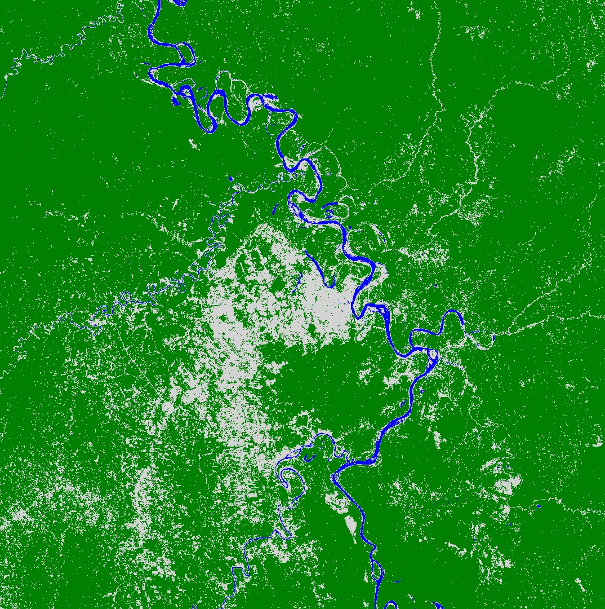

# Descripción General de Classifiers

Google Earth Engine ofrece a los usuarios la oportunidad de realizar muchos análisis avanzados, como la spectral un-mixing, object-based methods, eigen analysis and linear modeling.  También se dispone de técnicas de machine learning para la clasificación supervisada y no supervisada. En este ejemplo, utilizaremos la clasificación supervisada para la clasificación de la cobertura terrestre.

El propósito es obtener un mapa clasificado de la cobertura terrestre en un área de interés. Examinaremos las imágenes Landsat e identificaremos manualmente un conjunto de puntos de entrenamiento para tres clases (agua, bosque, urbano). Luego usaremos esos puntos para entrenar un clasificador. El algorítmo se utilizará para clasificar el resto de la imagen Landsat en esas tres categorías. Finalmente, podremos evaluar la precisión de nuestra clasificación usando `classifier.confusionMatrix()`.

*Adaptado de [Earth Engine 201 Intermediate workshop](https://developers.google.com/earth-engine/classification)*

# Ejercicio: Clasificar la cobertura del suelo usando las imágenes Landsat

### Delimitar un área de interés (ROI) a partir de coordenadas

Primero, necesitamos definir una región de interés (ROI). En lugar de utilizar un Asset importado, utilizaremos una única coordenada que definiremos manualmente. Estamos interesado en hacer una clasificación alrededor de Houston, así que usaré el centro de la ciudad como mi lat/lon.


// Definir una región de interés como un punto.  Cambiar las coordenadas
// para seleccionar ROI en su área de interés.
// Puede usar la herramienta de inspección para encontrar sus coordenadas
var roi = ee.Geometry.Point(-74.58,-8.39);


### Cargar una `ImageCollection` ya filtrarla para obtener una sola imágen

Ahora cargaremos las imágenes de Landsat y filtraremos el área y las fechas de interés.  Podemos usar `sort` para filtrar la `ImageCollection` por el % de cobertura de nubes, una propiedad incluida en la Landsat Top of Atmosphere (TOA) collection. Luego seleccionamos la `Image` que presente menor nubosidad`first` de la `ImageCollection` ordenada.



// Cargue la image collection: Landsat 8 scaled radiance.
var landsatCollection = ee.ImageCollection('LANDSAT/LC08/C01/T1')
    .filterDate('2017-01-01', '2017-12-31');

// Haz un compuesto sin nubes.
var composite = ee.Algorithms.Landsat.simpleComposite({
  collection: landsatCollection,
  asFloat: true
});

// Visualizar el compuesto
Map.addLayer(composite, {bands: ['B4', 'B3', 'B2'], max: 0.5, gamma: 2}, 'L8 Image', false);



### Seleccionar la data de entrenamiento

El segundo paso es recoger datos de entrenamiento.  Usando las imágenes como guía, pasa por encima de la casilla 'Geometry Imports' junto a la herramienta de dibujo de geometrías y haz clic en '+ new layer'.  Cada nueva capa representa una clase dentro de los datos de entrenamiento. Dejemos que la primera capa nueva represente 'urban'. 

Localice puntos en la nueva capa en áreas urbanas o edificadas (edificios, carreteras, aparcamientos, etc.).  Cuando termine de recolectar los puntos, haga clic en 'Exit' y configure la importación (parte superior del script) de la siguiente manera.  Nombrar la capa 'urban' y hacer clic en el icono para configurarla.  'Import as' `FeatureCollection`.  'Add property' landcover y establecer su valor a 0. (Las clases subsiguientes serán 1 para el agua, 2 para el bosque, etc.) cuando termine, haga clic en 'OK' como se muestra:

 

  

Cuando termines de hacer una `FeatureCollection` para cada clase (3 en total), puedes fusionarlas en una `FeatureCollection` usando `featureCollection.merge()`. Esto lo convertirá en una colección en la que la propiedad **landcover** tiene un valor que es la clase (0, 1, 2).


// Fusionar los puntos
var newfc = water.merge(urban).merge(forest);
print(newfc, 'newfc')


La declaración impresa mostrará la nueva colección en la **Console**.

### Realizar el muestreo de la imágen usando puntos de entrenamiento

Ahora que has creado los puntos y sus etiquetas, necesitas probar las imágenes Landsat 8 usando `image.sampleRegions()`. Este comando extraerá la reflectancia en las bandas designadas para cada uno de los puntos que has creado. Un diagrama conceptual de esto se muestra en la imagen de abajo. Usaremos la reflectancia de las bandas ópticas, NIR y SWIR (B2 - B7).

 

  


// Selecciona las bandas para el entrenamiento
var bands = ['B2', 'B3', 'B4', 'B5', 'B6', 'B7'];

// Muestre las imágenes de entrada para obtener una FeatureCollection de datos de entrenamiento.
var training = composite.select(bands).sampleRegions({
  collection: newfc,
  properties: ['landcover'],
  scale: 30
});


La `FeatureCollection` llamada **training** tiene el valor de reflectancia de cada banda almacenado para cada punto de entrenamiento junto con su etiqueta de clase.

### Entrenar el clasificador
Ahora inicializaremos un `classifier` usando `ee.Classifier.randomForest()` y `train` en los datos de entrenamiento especificando las características a usar (entrenamiento), las categorías de la cobertura del suelo como `classProperty` en la que queremos categorizar las imágenes, y la reflectancia en B2 - B7 de las imágenes Landsat como las `inputProperties`.


// Haz un clasificador de Random Forest y entrénalo.
var classifier = ee.Classifier.randomForest().train({
  features: training,
  classProperty: 'landcover',
  inputProperties: bands
});


Otros clasificadores, incluyendo Support Vector Machines (SVM) y Classification and Regression Trees (CART) están disponibles en GEE. Ver el [Supervised Classification User Guide](https://developers.google.com/earth-engine/classification) for more examples.

### Clasificar la imágen y plotear los resultados

Usa el nuevo `classifier` para clasificar el resto de las imágenes.


// Clasificar las imágenes de entrada.
var classified = composite.select(bands).classify(classifier);

// Definir una paleta para la clasificación del uso de la tierra.
var palette = [
  'D3D3D3', // urban (0)  // grey
  '0000FF', // water (1)  // blue
  '008000' //  forest (2) // green
];

// Muestra el resultado de la clasificación y la imagen de entrada.
Map.setCenter(-96.0171, 29.6803);
Map.addLayer(classified, {min: 0, max: 2, palette: palette}, 'Land Use Classification');


Deberías obtener una imagen que se parezca a la de abajo. ¡Desplácese por el mapa y use el inspector para ver cómo lo hizo!

 

  

### Evaluar la precisión

Podemos evaluar la precisión del `classifier` entrenado usando una `confusionMatrix`.



// Estima la matriz de confusión que represente la precisión de la clasificación.
print('RF error matrix: ', classifier.confusionMatrix());
print('RF accuracy: ', classifier.confusionMatrix().accuracy());



Advertencia: En este ejemplo en particular, sólo estamos observando el `trainAccuracy`, que básicamente describe lo bien que el `classifier` fue capaz de etiquetar correctamente los datos de entrenamiento sustituidos, es decir, los datos que el `classifier` ya había reconocido. Para obtener una verdadera precisión de validación, necesitamos mostrarle al clasificador los nuevos datos de 'testing'. El script del repositorio tiene una sección extra al final que mantiene los datos para las pruebas, aplica el clasificador a los datos de las pruebas y evalúa la `errorMatrix` para estos datos de validación. El último ejemplo en el [Supervised Classification User Guide](https://developers.google.com/earth-engine/classification) también da un script ejemplo para este proceso.

Enlace al código completo que usamos en esta sesión:
[https://code.earthengine.google.com/86b72b6fb9040967b66f09b17ce26c84](https://code.earthengine.google.com/86b72b6fb9040967b66f09b17ce26c84)