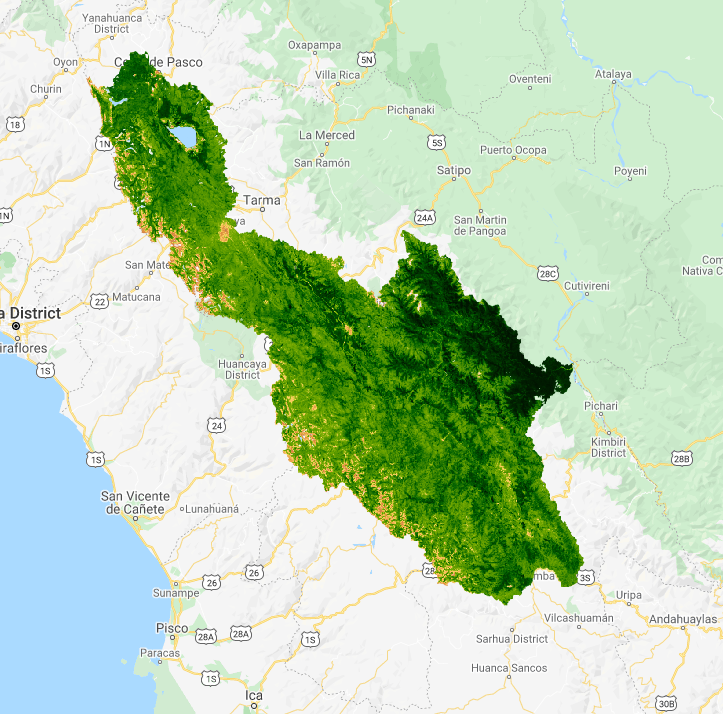
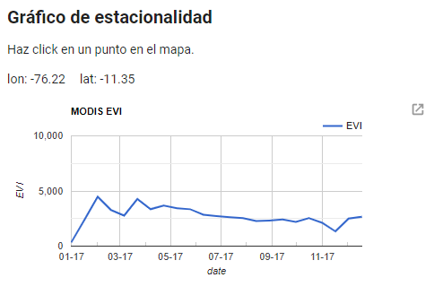
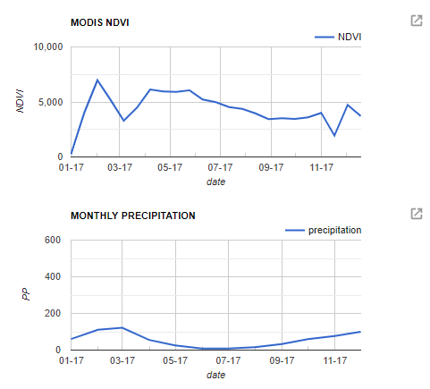

## Descripción general

Este código permite a los usuarios generar gráficos de series de tiempo a partir de puntos que son elegidos dinámicamente en un mapa. Las series temporales muestran los compuestos de 16 días del Normalized Difference Vegetation Index (NDVI) y Enhanced Vegetation Index (EVI) con una resolución de 250 m. Estos índices se derivan de MODIS.

## Definir especificaciones

Este script está estructurado para facilitar al usuario la selección de diferentes imágenes, fechas y regiones. Para este ejercicio, vamos a dejar los parámetros tal como están para establecer la extensión como área de estudio en el Medio Oeste, la Cuenca Republican River Basin


// cargue las cuencas del Perú y seleccione la de su interés
var watershedBoundaries = ee.FeatureCollection('users/hasencios/Cuencas_Peru');
Map.addLayer(watershedBoundaries, {}, 'watersheds',false);
var setExtent = watershedBoundaries.filterMetadata('NOMBRE', 'equals', 'Cuenca Mantaro');

// fechas de consulta
var startyear = 2017;
var endyear = 2017;
var startdate = ee.Date.fromYMD(startyear,1,1);
var enddate = ee.Date.fromYMD(endyear,12,31)


 

## Cargar una imágenes de máximo verdor como un asset

Aquí estamos cargando una imágen de Greenness Index (GI) calculado a partir de las imágenes Landsat. En lugar de calcular el GI en este script, hemos cargado lo que previamente se calculó y exportó. Este script constituye un ejemplo de cómo se cargan assets en la consola. Prácticas como esta pueden ayudar a acelerar su script.

1. Un Greenness Index derivado de las imágenes del Landsat (30 m) específicas de la zona de estudio. Este índice se calcula tomando un compuesto del píxel más verde, definido como el píxel con el NDVI más alto, durante un período de tiempo determinado, en nuestro caso el año 2017.



// Compuestos derivados de Landsat --------------------

// imagen de máximo verdor anual (asset previamente exportado)
var annualGreenest = ee.Image('users/hasencios/greenest_2017_L8_NDVI_image');


## Cargar los productos derivados de MODIS: NDVI y EVI, así como CHIRPS v2.0

El NDVI y el EVI son dos índices de vegetación diferentes que pueden ser calculados a partir de las bandas roja e infrarroja cercanas. Aquí estamos usando un producto compuesto derivado de MODIS de 16 días que tiene bandas precalculadas para el NDVI y el EVI. También podrías calcularlas tú mismo usando la función `normalizedDifference`. De nuevo filtraremos la colección a las fechas, bandas y región de interés.

Además, estamos cargando la base de datos del producto de precipitación CHIRPS v2.0 y estamos agregándola a escala mensual para compararla con los productos antes mencionados.



// añadir series temporales de satélites: MODIS EVI 250m 16 días -------------
var collectionModEvi = ee.ImageCollection('MODIS/006/MOD13Q1')
    .filterDate(startdate,enddate)
    .filterBounds(setExtent)
    .select("EVI");
    
// añadir series temporales de satélites: MODIS NDVI 250m 16 días -------------
var collectionModNDVI = ee.ImageCollection('MODIS/006/MOD13Q1')
    .filterDate(startdate,enddate)
    .filterBounds(setExtent)
    .select("NDVI");
    
// añadir series temporales de precipitación: CHIRPS 2.0
var collectionCHIRPS = ee.ImageCollection("UCSB-CHG/CHIRPS/PENTAD");
// crear una lista de años
var years = ee.List.sequence(startyear,endyear);
// crear una lista de meses
var months = ee.List.sequence(1,12);
// filtrar chirps
var Pchirps = collectionCHIRPS.filterDate(startdate, enddate)
  // Sort chronologically in descending order.
  .sort('system:time_start', false)
  .select("precipitation");
// calcular la P para cada mes
var MonthlyChirps =  ee.ImageCollection.fromImages(
  years.map(function (y) {
  return months.map(function(m){
    var w = Pchirps.filter(ee.Filter.calendarRange(y, y, 'year'))
             .filter(ee.Filter.calendarRange(m, m, 'month'))
             .sum();
    return w.set('year', y)
             .set('month', m)
             .set('system:time_start',ee.Date.fromYMD(y,m,1)) 
             .set('date', ee.Date.fromYMD(y,m,1))
});
}).flatten());
	


## Visualizar la base de datos de imágenes de alta resolución

Aquí realizaremos un mapa del producto Annual Greenest Pixel que hemos cargado.
 - *Consejo para ahorrar tiempo:* Si estás usando un conjunto de datos públicos, a menudo puedes encontrar  paletas tamizando los mensajes del foro. Algunas como la CDL vienen con una paleta incrustada.
 - *Consejo:* Los plugins de selección de colores de los navegadores hexadecimales son útiles para averiguar qué colores corresponden a qué códigos.
 - *Consejo:* Usa el argumento `false` si quieres cargar una capa en el mapa pero NO la tienes activada cada vez que ejecutas el código.

 

// ----------------------------------------------------------------------------------------
// Visualiza
// ----------------------------------------------------------------------------------------

Map.centerObject(setExtent, 8);

// usa esta paleta para EVI
var palette = [
  'FFFFFF', 'CE7E45', 'DF923D', 'F1B555', 'FCD163', '99B718',
  '74A901', '66A000', '529400', '3E8601', '207401', '056201',
  '004C00', '023B01', '012E01', '011D01', '011301'];

// imágenes de verdor
print(annualGreenest)
Map.addLayer(annualGreenest, 
    {min:0, max: 1, palette: palette}, 'GI - annual (2017)');



 

  

## Crear una User Interface

Puedes alterar la client-side user interface (UI) a través del paquete ui añadiendo widgets a la interfaz del Code Editor. Puedes leer sobre el paquete ui en el [UI Overview section](https://developers.google.com/earth-engine/ui) de la Guía del Desarrollador.
La idea general es que se hace un widget, que puede ser simple (un botón) o complejo (un gráfico). Luego defines el comportamiento del widget y luego lo agregas a la pantalla. Aquí crearemos un panel, definiremos el contenido del panel usando etiquetas y crearemos una función de respuesta al requerimiento para que el usuario pueda hacer clic en un punto y éste registre la lat/lon como un objeto llamado `points`. Puedes leer más acerca de cómo definir el panel y los diseños en el [Panels section](https://developers.google.com/earth-engine/ui_panels) de la Guía del Desarrollador.



// ----------------------------------------------------------------------------------------
// Crear la interfaz de usuario
// ----------------------------------------------------------------------------------------

// Crear un panel para guardar nuestros widgets.
var panel = ui.Panel();
panel.style().set('width', '500px');

// Crea un panel de introducción con etiquetas.
var intro = ui.Panel([
  ui.Label({
    value: 'Gráfico de estacionalidad',
    style: {fontSize: '20px', fontWeight: 'bold'}
  }),
  ui.Label('Haz click en un punto en el mapa.')
]);
panel.add(intro);

// paneles para mantener los valores lon/lat
var lon = ui.Label();
var lat = ui.Label();
panel.add(ui.Panel([lon, lat], ui.Panel.Layout.flow('horizontal')));

// Registrar una llamada en el mapa por defecto para ser invocada cuando se haga clic en el mapa
Map.onClick(function(coords) {
  // Actualiza el panel lon/lat con los valores del evento click.
  lon.setValue('lon: ' + coords.lon.toFixed(2)),
  lat.setValue('lat: ' + coords.lat.toFixed(2));
  var point = ee.Geometry.Point(coords.lon, coords.lat);

  

## Agregar los gráficos de series de tiempo a los paneles

Ahora que hemos configurado nuestra interfaz de usuario y construido el 'call-back', podemos definir un gráfico de series de tiempo. El gráfico utiliza la lat/lon seleccionada por el usuario y construye una serie temporal para el NDVI, el EVI y la precipitación en ese punto. Toma el promedio de estas variables en ese punto, las extrae y luego las agrega a serie de tiempo. Entonces esta series de tiempo son graficadas.

 

  // Crear un gráfico MODIS EVI.
  var eviChart = ui.Chart.image.series(collectionModEvi, point, ee.Reducer.mean(), 250);
  eviChart.setOptions({
    title: 'MODIS EVI',
    vAxis: {title: 'EVI', maxValue: 9000},
    hAxis: {title: 'date', format: 'MM-yy', gridlines: {count: 7}},
  });
  panel.widgets().set(2, eviChart);
  
  // Crear un gráfico MODIS NDVI.
  var ndviChart = ui.Chart.image.series(collectionModNDVI, point, ee.Reducer.mean(), 250);
  ndviChart.setOptions({
    title: 'MODIS NDVI',
    vAxis: {title: 'NDVI', maxValue: 9000},
    hAxis: {title: 'date', format: 'MM-yy', gridlines: {count: 7}},
  });
  panel.widgets().set(3, ndviChart);
  
    // Crear un gráfico MODIS EVI.
  var ppChart = ui.Chart.image.series(MonthlyChirps, point, ee.Reducer.mean(), 5000);
  ppChart.setOptions({
    title: 'MONTHLY PRECIPITATION',
    vAxis: {title: 'PP', maxValue: 500},
    hAxis: {title: 'date', format: 'MM-yy', gridlines: {count: 7}},
  });
  panel.widgets().set(4, ppChart);
});

Map.style().set('cursor', 'crosshair');

// Añade el panel a la ui.root.
ui.root.insert(0, panel);



Deberías ver algo como esto en la parte inferior izquierda:

 

  

## Explorar los gráficos NDVI, EVI y PRECIPITATION para diferentes lugares.

Utiliza el inspector para hacer clic en los píxeles con diferentes niveles de verdor y explora las diferencias en las series temporales del NDVI, EVI y PRECIPITATION entre los diferentes píxeles.

## Extraer las series de tiempo para grandes regiones o puntos de interés

Si estás calculando índices en este script, o tienes muchos puntos o áreas de interés, puedes tener la desagradable experiencia de que tu código se demora mucho. Una forma de evitarlo es exportar las series temporales como un .csv a Google Drive o Cloud Storage. Un ejemplo de cómo hacer esto se puede encontrar en
 [Módulo 04: Reductores espaciales y temporales](https://hasencios.github.io/GEE_BASICO_SENAMHI/04-reducers/) de este tutorial.

Enlace a una versión estática del script completo utilizado en este módulo:
[https://code.earthengine.google.com/c5d83beb8d7c31404517eb127f6a1e06](https://code.earthengine.google.com/c5d83beb8d7c31404517eb127f6a1e06)

